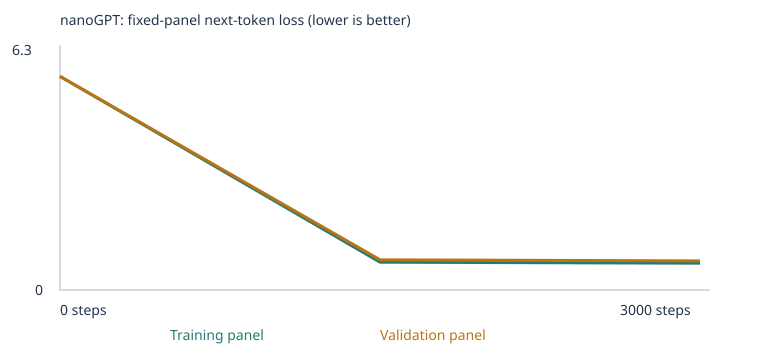
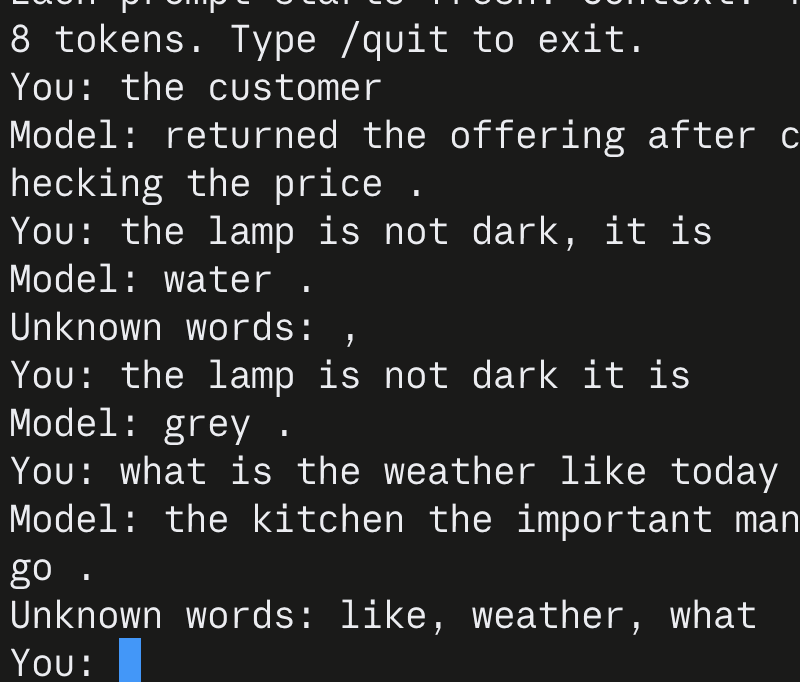
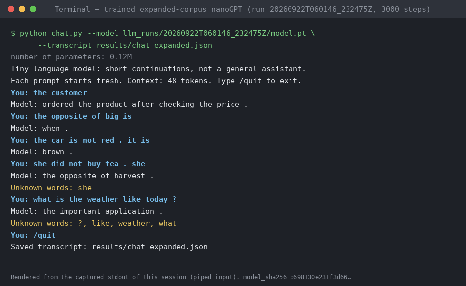

# Custom LLM: a tiny nanoGPT, two corpora, 48 fixed evals

**Author:** Gonzalo · **Course:** From Zero to AI Agents (Fall 26), Class 4 · **Model:** Karpathy's nanoGPT (pinned commit `3adf61e`), 2 blocks × 4 heads × 64-number embeddings, word tokens, 48-token context, CPU only.

> This is a tiny next-word model trained on a narrow synthetic corpus. It continues sentences. It is not a chat assistant, and nothing here demonstrates general language understanding.

## Start here

| What the grader needs | Where |
|---|---|
| Executed notebook, starter experiment | [`custom_llm_starter.executed.ipynb`](custom_llm_starter.executed.ipynb) |
| Executed notebook, expanded-corpus experiment | [`custom_llm_expanded.executed.ipynb`](custom_llm_expanded.executed.ipynb) |
| Four-row eval comparison and all four result sets | [§6.1](#61-four-row-comparison) |
| Extension categories and the data I added | [§3](#3-corpus) |
| Coverage vs. learned pattern, with control tests | [§6.4](#64-coverage-or-learned-pattern-control-probes) |
| Chat interface, launch instructions, live screenshot, transcripts | [§7](#7-chat-interface) |
| My own hold-out tests (15 cases I wrote, all models) | [§6.8](#68-my-own-hold-out-tests) |
| Optional third experiment: adding a novel excerpt with no teaching | [§6.7](#67-optional-run-3-a-novel-excerpt-with-no-teaching) |
| Interactive dashboard (runs the trained models in your browser) | [live page](https://gonzalomadrazo-pixel.github.io/custom-llm-project/dashboard.html) · [`dashboard.html`](dashboard.html) |
| Learning explanation | [§8](#8-what-i-learned) |

| Experiment | Run folder | Results ZIP | Trained model SHA-256 |
|---|---|---|---|
| Starter corpus | [`llm_runs/20260922T060103_576381Z`](llm_runs/20260922T060103_576381Z) | [ZIP](llm_runs/20260922T060103_576381Z.zip) | `4948e2fce70ec0b0c0a5b5ccfc6ea4daba9137683b88446579d31213ac1e91b4` |
| Expanded corpus | [`llm_runs/20260922T060146_232475Z`](llm_runs/20260922T060146_232475Z) | [ZIP](llm_runs/20260922T060146_232475Z.zip) | `c698130e231f3d66c1038d83e45f826150100e24d851edc90588b01aa55f90cb` |
| Optional run 3: expanded + *Tom Sawyer* ch. I–III | [`llm_runs/20260923T033633_820623Z`](llm_runs/20260923T033633_820623Z) | [ZIP](llm_runs/20260923T033633_820623Z.zip) | `fdad77955fc5b0364580c3e65135b7d7f6cda9bbff3e08edfd772c3343c88ded` |

## 1. Overview

I trained the supplied nanoGPT twice with identical settings, changing only the corpus. Experiment 1 uses the classroom corpus. Experiment 2 adds two teaching files for the **opposites** and **negation** eval categories. Both runs evaluate all 48 fixed test cases before and after training. The expanded model is connected to a terminal chat interface.

The short version: training raised the starter model from 9/48 to 20/48, but it stayed at 0/24 on the extension challenges because the vocabulary simply wasn't there. The expanded corpus raised that to 5/24 and the total to 27/48. Control tests show the opposites gain reflects a learned word pairing, while the negation gain is a frequency artifact of my corpus design rather than the model reading the negation (§6.4).

## 2. My three choices and my prediction

| Setting | Value (both experiments) | Reason |
|---|---|---|
| Corpus | Exp. 1: classroom only. Exp. 2: classroom + `corpus/opposites.txt` + `corpus/negation.txt` | Exp. 1 is the required baseline. Exp. 2 changes only the corpus, so differences can be attributed to the data. |
| Training steps | 3,000 | The assignment's recommended starting budget. A 10-step run checked the setup first. Held identical so the corpus is the only variable. |
| Learning rate | 0.001, with a 100-step linear warmup and cosine decay to 10% | The default. Too large a step overshoots and can make loss diverge (the notebook stops on a nonfinite loss). Too small a step barely moves the weights in 3,000 steps. During warmup the first update uses only 1e-05 (§5.4). |

Everything else stayed fixed: seed 42, batch size 32, 90/10 passage split, the same evaluation panels, sampling seed 2026 at temperature 0.8.

### My prediction

Written after the runs, I would have expected the training and the model's answers to be much more connected than they actually were. I could see that the training worked in some cases, but I thought the model would be better at understanding what I was asking and using the information I gave it. I also expected the extra information to help it make better connections between words.

## 3. Corpus

### Sources and permissions

- **Classroom corpus (both runs):** synthetic sentences produced by the notebook's `classroom_corpus()` function. After removing 160 passages that contain reserved eval prefixes, 6,200 passages remain, 4,592 of them unique.
- **Extension files (run 2 only):** two UTF-8 text files I authored for this assignment, generated by [`make_extension_corpus.py`](make_extension_corpus.py) with a fixed seed. Re-running the script reproduces byte-identical files. No third-party text is included, so there are no permission issues.
- **Novel excerpt (optional run 3 only):** chapters I–III of *The Adventures of Tom Sawyer* by Mark Twain, from Project Gutenberg eBook #74, which is marked public domain in the USA. I converted the EPUB to plain text, one paragraph per line, and removed the Project Gutenberg header, license, table of contents and illustration captions: [`corpus/literature/tom_sawyer_ch01-03.txt`](corpus/literature/tom_sawyer_ch01-03.txt), 185 paragraphs, 8,125 tokens.
- **PDF extraction:** not applicable, because I used no PDFs. The manifest ([starter](llm_runs/20260922T060103_576381Z/corpus_manifest.json), [expanded](llm_runs/20260922T060146_232475Z/corpus_manifest.json)) shows both TXT files imported with no warnings.

### Why opposites and negation

The starter model had 0% vocabulary coverage on all 24 extension cases, so any extension category required new words. I chose these two because each can be taught with short sentences over a small closed vocabulary (antonym pairs, colors, states, foods), which fits the 509-type vocabulary cap. They also test different abilities. Opposites is a word-to-word association. Negation requires using earlier context: the model has to read "not X … it is Y" and answer Y.

### What I added

| File | Lines | Passages after import (unique) | Content |
|---|---|---|---|
| [`corpus/opposites.txt`](corpus/opposites.txt) | 341 | 341 (329) | 28 antonym pairs in six frames, in both directions ("the opposite of cold is hot .", "cold and hot are opposites ."), plus 8 grounding sentences. The eval stems *hot*, *empty* and *noisy* never appear in the frame "the opposite of X is", so the evals test whether the model generalizes from the reverse direction. |
| [`corpus/negation.txt`](corpus/negation.txt) | 184 | 538 (338) | Correction stories with different subjects and people than the evals, e.g. "the sky is not green . it is yellow . the sky is yellow ." and "omar did not buy tea . omar bought milk . omar bought milk ." |

In total, 667 new unique passages. The vocabulary grew from 136 to 283 token types, all retained below the cap.

### Keeping the evals out of training

- The generator runs the course's own `matching_cases` check against `evals/language_evals.json` and refuses to write any file that contains an eval prompt.
- The notebook repeats the check on every imported file and every final passage, and withholds 160 classroom passages containing the 16 reserved starter prefixes before splitting or building the vocabulary ([starter](llm_runs/20260922T060103_576381Z/eval_separation.json) and [expanded](llm_runs/20260922T060146_232475Z/eval_separation.json) `eval_separation.json`).
- `evals/language_evals.json` is unchanged. Its SHA-256 (`e8affcd7…3e17f7`) matches the version pinned in the notebook, and the repository's 14 unit tests pass.
- **Limits:** the check matches exact normalized prompt text, not meaning. My teaching data deliberately reuses eval *answer and distractor words* (blue, closed, milk, warm, loud…), which the assignment permits. Section 6.4 shows this reuse confounded the negation result.

### Two corpus design flaws, found after training and disclosed rather than hidden

1. **Sentence splitting.** The notebook splits imported text into passages at every sentence boundary. Each three-sentence negation example therefore became three separate passages (184 lines → 538 passages). The model never saw a negation and its resolution inside the same context window, so it could not learn the pattern as designed.
2. **Answer-word frequency.** I reinforced the eval answer words in the sentence-final slot (blue ≈ 47 times, milk ≈ 39, closed ≈ 32). That gives the model a frequency bias toward those words regardless of context.

Evidence for both is in §6.4, and the fix is my next experiment (§9).

## 4. My run

| | Starter | Expanded |
|---|---|---|
| Completed steps / interrupted | 3,000 / no | 3,000 / no |
| Training time | 26.6 s | 28.1 s |
| Hardware | Linux x86_64 container, 1 CPU core, PyTorch 2.4.1 CPU, run by my AI assistant in an earlier session (the PyTorch version is recorded in the notebook output) | same |
| Parameters | 111,872 | 121,280 |
| Vocabulary (incl. `<UNK>`, `<BOS>`, `<EOS>`) | 136 | 283 |
| Unique passages / train / validation | 4,592 / 4,132 / 460 | 5,259 / 4,733 / 526 |
| Loss panel sizes (train / validation) | 20 / 20 | 20 / 20 |
| Training unknown-token rate | 0.00% | 0.00% |
| Held-out unknown-token rate | 0.00% | 0.07% (*calm*, *plate*, *room* occur only in validation passages) |

Links: config ([starter](llm_runs/20260922T060103_576381Z/config.json), [expanded](llm_runs/20260922T060146_232475Z/config.json)), training summary ([starter](llm_runs/20260922T060103_576381Z/training_summary.json), [expanded](llm_runs/20260922T060146_232475Z/training_summary.json)), training.csv ([starter](llm_runs/20260922T060103_576381Z/training.csv), [expanded](llm_runs/20260922T060146_232475Z/training.csv)), vocabulary report ([starter](llm_runs/20260922T060103_576381Z/vocabulary_report.json), [expanded](llm_runs/20260922T060146_232475Z/vocabulary_report.json)).

The 509-type cap was never reached, so every word that mattered was retained. The split is by passage, not by source file, and validation passages come from the same templates as training. The validation loss therefore measures fit to familiar templates, not generalization to new documents.

## 5. Evidence from training

### 5.1 Loss curves

Starter:


Expanded:



All measured values, from `history.json` ([starter](llm_runs/20260922T060103_576381Z/history.json), [expanded](llm_runs/20260922T060146_232475Z/history.json)). These are fixed panels of 20 training and 20 validation passages, averaged over non-padding next-token targets. They are small estimates, not full-corpus measurements.

| Experiment | Step | Training-panel loss | Validation-panel loss |
|---|---|---|---|
| Starter | 0 | 4.9263 | 4.9275 |
| Starter | 1500 | 0.6821 | 0.7182 |
| Starter | 3000 | 0.6783 | 0.7061 |
| Expanded | 0 | 5.6851 | 5.6871 |
| Expanded | 1500 | 0.7391 | 0.8052 |
| Expanded | 3000 | 0.7127 | 0.7760 |

Observations:
- The untrained loss is close to ln(vocabulary size): ln 136 = 4.91 vs. 4.93, and ln 283 = 5.65 vs. 5.69. At initialization the model is essentially guessing uniformly.
- Almost all of the drop happens before step 1,500. Between steps 1,500 and 3,000 neither loss moves by more than 0.04.
- Validation stays slightly above training (gap 0.03 starter, 0.06 expanded). Because validation shares templates with training, a small gap does not demonstrate generalization.
- The two runs' losses are not directly comparable, because their vocabularies and corpora differ.

### 5.2 Samples: untrained, halfway, final

Same sampling seed and temperature (0.8) at every stage. Full files: [starter samples](llm_runs/20260922T060103_576381Z/samples), [expanded samples](llm_runs/20260922T060146_232475Z/samples).

| Step | Sample 1 | Sample 2 | Sample 3 | Sample 4 |
|---|---|---|---|---|
| 0 (untrained) | `nora juice true did compared package poor missing lesson train lid sad old so detail are care website school so compared take sky apple price offering feels instructor care product payment something` | `thick pick cool roof lena bread cup window investment package different quality near student small fence dark black train book fence program glass was sea pasta gate in and payment checking subscriber` | `peach wall they apples hot new truck tea risk something payment tutor tea discussion clean application bank road checking buy leo door big important consumer offering glass lid discussion local choose sea` | `missing return lid lid lid <BOS> finn dentist car bought bright iris with rich poor lesson application student application on key and true low interest glass detail bicycle light cup big did` |
| 1,500 (halfway) | `a review of fruit helped us understand the local mango .` | `we learned about the local website during a discussion of code .` | `they compared the new product with another merchandise at the market .` | `the new investment was mentioned in the payment report yesterday .` |
| 3,000 (final) | `a review of fruit helped us understand the local mango .` | `our kitchen has a question about the important mango and juice .` | `they compared the new product with another merchandise at the market .` | `our kitchen has a question about the different apple and juice .` |

<details><summary>Starter-run samples</summary>

| Step | Sample 1 | Sample 2 | Sample 3 | Sample 4 |
|---|---|---|---|---|
| 0 (untrained) | `mentioned travel system mentioned instructor and client credit yesterday patient purchase brand course offering market bank discussion physician discussed consumer instructor merchandise course instructor in course lesson taste update market health during` | `ordered doctor investment package website customer juice product teacher journey merchandise in physician on payment product learned care travel compared product fruit return software kitchen price the system another offering educator` | `traffic lesson today at student software important yesterday fruit we interest a a nurse fruit banana bus physician educator design with offering car surgeon interest interest return service nurse taxi the offering` | `a a client apple learning <BOS> professor educator market consumer data team question harvest banana yesterday banana mango banana <BOS> treatment another interest with taxi return market buyer . juice car mentioned` |
| 1,500 (halfway) | `a review of taste helped us understand the important orange .` | `we learned about the different physician during a discussion of treatment .` | `today the bank focused on return and the important investment .` | `we learned about the different merchandise during a discussion of quality .` |
| 3,000 (final) | `a review of patient helped us understand the important dentist .` | `we learned about the different physician during a discussion of treatment .` | `today the store focused on service and the important client .` | `we learned about the different merchandise during a discussion of quality .` |

</details>

**Visible change.** At step 0 the output is random word salad drawn from the whole vocabulary, including a stray `<BOS>`. By step 1,500 every sample is a grammatical classroom template, and step 3,000 looks almost the same, matching the flat loss after the halfway point. Unconditional samples from the expanded model never produce negation or opposite sentences: the classroom text is about 87% of the unique passages, so its templates dominate generation.

### 5.3 Token → ID → vector (expanded run)

From [`tokenization.json`](llm_runs/20260922T060146_232475Z/tokenization.json): the training passage `the report about the bus explains the route in detail .` becomes IDs `[1, 247, 198, 5, 247, 31, 82, 247, 209, 113, 65, 3, 2]`. ID 1 is `<BOS>` and ID 2 is `<EOS>`. IDs are row numbers in an alphabetical vocabulary, not quantities.

The probe word **`customer`** has **ID 57**. Its embedding is row 57 of the 283 × 64 token-embedding table ([`inspection.json`](llm_runs/20260922T060146_232475Z/inspection.json)):

| | First 8 of 64 numbers |
|---|---|
| Before training | `[0.0284, -0.0140, -0.0060, -0.0078, 0.0075, 0.0255, 0.0075, -0.0086]` |
| After training | `[0.0008, -0.0985, -0.0288, 0.0669, -0.0405, 0.0262, 0.1127, -0.0179]` |

<details><summary>All 64 numbers</summary>

Before: `[0.0284, -0.0140, -0.0060, -0.0078, 0.0075, 0.0255, 0.0075, -0.0086, 0.0002, -0.0236, -0.0070, 0.0050, -0.0251, 0.0119, -0.0275, -0.0169, -0.0054, -0.0328, -0.0005, 0.0077, 0.0226, -0.0265, -0.0108, 0.0197, 0.0148, -0.0189, 0.0286, -0.0103, -0.0497, -0.0458, 0.0071, -0.0085, 0.0199, -0.0114, 0.0243, -0.0202, 0.0097, 0.0020, -0.0265, -0.0058, -0.0277, -0.0010, 0.0211, -0.0193, 0.0097, 0.0058, 0.0204, 0.0147, -0.0053, 0.0283, -0.0345, 0.0185, 0.0629, -0.0082, 0.0065, -0.0420, 0.0345, -0.0000, -0.0134, 0.0080, 0.0096, -0.0254, -0.0093, -0.0191]`

After: `[0.0008, -0.0985, -0.0288, 0.0669, -0.0405, 0.0262, 0.1127, -0.0179, -0.0642, -0.0239, -0.0508, 0.0456, -0.1024, -0.0335, -0.1055, 0.0882, 0.1350, 0.0011, -0.0533, -0.0184, 0.0547, -0.0776, 0.1251, -0.0439, 0.1457, -0.1039, -0.0790, -0.0079, -0.0613, -0.1019, 0.1743, -0.1041, -0.0023, 0.0752, 0.0593, -0.1853, 0.0448, 0.0288, -0.0169, -0.1397, 0.0231, -0.1230, -0.0930, 0.1132, 0.0628, 0.0307, -0.0045, -0.0413, 0.0019, 0.0354, -0.1283, -0.0661, 0.1424, -0.0156, 0.0798, 0.1070, -0.0072, -0.0004, 0.0036, -0.1315, 0.1005, 0.1263, 0.0412, 0.1296]`

</details>

Cosine nearest neighbors over all 64 dimensions, computed from [`checkpoint.json`](llm_runs/20260922T060146_232475Z/checkpoint.json) (the same data the embedding viewer loads):

| Word | Nearest 5 before training | Nearest 5 after training |
|---|---|---|
| `customer` | soda (0.34), deposit (0.27), word (0.27), warm (0.26), review (0.24) | subscriber (0.96), shopper (0.96), consumer (0.95), buyer (0.95), client (0.95) |
| `hot` | yellow (0.35), boat (0.31), lecturer (0.30), checking (0.29), return (0.28) | thick (0.79), down (0.77), bright (0.75), small (0.75), rich (0.74) |
| `closed` | returned (0.36), consumer (0.31), the (0.30), website (0.28), finn (0.26) | open (0.88), dry (0.83), dirty (0.83), clean (0.75), empty (0.74) |
| `milk` | long (0.36), hospital (0.33), clean (0.29), credit (0.27), client (0.27) | bread (0.77), pears (0.74), tea (0.71), long (0.55), rice (0.55) |

Before training the neighbors are random. After training, `customer` clusters with the words that fill the same classroom slot. `closed` ends up closest to its own opposite, `open`: antonyms appear in identical contexts, so these embeddings encode "same slot", not "opposite meaning". `milk` clusters with the other things people "bought" in the negation stories.

### 5.4 One real gradient and parameter update

From `inspection.json` → `first_update`: coordinate 0 of the `customer` embedding at the very first training step.

| Value before | Gradient | Learning rate at step 1 | Value after | Change |
|---|---|---|---|---|
| 0.028419973 | 0.004854420 | 0.00001 (0.001 × 1/100 warmup) | 0.028409969 | −0.0000100 |

The gradient is positive, so the update moves the weight down. The size of the change equals the learning rate (1e-05) to four significant figures, not learning rate × gradient (which would be ~5e-08). On its first step AdamW divides the gradient by its own running magnitude, so the step is roughly lr × sign(gradient). Weight decay adds a negligible ~3e-09.

### 5.5 Next-token probabilities for the same prefix

| | Top-5 next tokens after `the customer` |
|---|---|
| Before training | customer 0.0073, here 0.0055, cool 0.0051, our 0.0050, nurse 0.0050 |
| After training | recommended 0.1834, selected 0.1785, reviewed 0.1674, ordered 0.1553, returned 0.1486 |

Before training the distribution is nearly flat (no token above 0.8%). After training, about 83% of the probability goes to five verbs, exactly the classroom pattern "the customer ordered/reviewed/… the product after checking the price".

### 5.6 Attention (block 1, head 1, prefix `the customer`)

| Query token | attends to `<BOS>` | `the` | `customer` |
|---|---|---|---|
| `<BOS>` | 1.000 | 0 | 0 |
| `the` | 0.251 | 0.749 | 0 |
| `customer` | 0.151 | 0.078 | 0.771 |

Every row sums to 1, and the upper triangle is exactly 0. That is the causal mask: a position can only combine information from itself and earlier tokens, never future ones.

### 5.7 Temperature comparison (no retraining)

Same trained weights, same sampling seed, temperatures 0.3 / 0.8 / 1.2 ([starter](llm_runs/20260922T060103_576381Z/temperature_comparison.json), [expanded](llm_runs/20260922T060146_232475Z/temperature_comparison.json)). Expanded run:

| Sample | T = 0.3 | T = 0.8 | T = 1.2 |
|---|---|---|---|
| 1 | `a review of fruit helped us understand the local mango .` | `a review of fruit helped us understand the local mango .` | `a review of fruit helped us understand the local mango .` |
| 2 | `the different doctor was mentioned in the health report yesterday .` | `our kitchen has a question about the important mango and juice .` | `our kitchen has a question about the important mango and juice .` |
| 3 | `the new banana was mentioned in the juice report yesterday .` | `they compared the new product with another merchandise at the market .` | `they compared the new product with another merchandise at the market .` |
| 4 | `the local offering was mentioned in the quality report yesterday .` | `our kitchen has a question about the different apple and juice .` | `they compared the new different teacher and the different tutor .` |

Most samples are identical at all three temperatures. On memorized template tokens the distribution is so peaked that the same random draw selects the same word even after rescaling. Differences appear where the model is genuinely uncertain, mostly at the first token (which of the eight templates to start). At 1.2, sample 4 blends two templates into "they compared the new different teacher and the different tutor". Temperature only rescales the logits at sampling time. No weights change.

## 6. Fixed language evals

The unchanged suite is [`evals/language_evals.json`](evals/language_evals.json) (48 cases: 16 starter patterns, 8 new phrasings, 24 extension challenges), and the runner is [`run_evals.py`](run_evals.py). A case scores 1 only if the correct word has the highest probability among its four choices. Ties score 0. Cases containing a word outside the model's vocabulary are unscorable and count as 0 in the all-case rate. The runner also saves an unrestricted free continuation for every case. These are public development tests that guided my corpus choices, not an unseen final benchmark.

### 6.1 Four-row comparison

| Experiment | Stage | Correct / 48 | Scorable / 48 | Accuracy among scorable | Full results |
|---|---|---|---|---|---|
| Starter corpus | Untrained | 9 (18.8%) | 24 | 9/24 = 37.5% | [CSV](llm_runs/20260922T060103_576381Z/language_evals/untrained/eval_results.csv) · [JSON](llm_runs/20260922T060103_576381Z/language_evals/untrained/eval_results.json) · [summary](llm_runs/20260922T060103_576381Z/language_evals/untrained/eval_summary.json) |
| Starter corpus | Trained | 20 (41.7%) | 24 | 20/24 = 83.3% | [CSV](llm_runs/20260922T060103_576381Z/language_evals/final/eval_results.csv) · [JSON](llm_runs/20260922T060103_576381Z/language_evals/final/eval_results.json) · [summary](llm_runs/20260922T060103_576381Z/language_evals/final/eval_summary.json) |
| Expanded corpus | Untrained | 5 (10.4%) | 29 | 5/29 = 17.2% | [CSV](llm_runs/20260922T060146_232475Z/language_evals/untrained/eval_results.csv) · [JSON](llm_runs/20260922T060146_232475Z/language_evals/untrained/eval_results.json) · [summary](llm_runs/20260922T060146_232475Z/language_evals/untrained/eval_summary.json) |
| Expanded corpus | Trained | 27 (56.2%) | 29 | 27/29 = 93.1% | [CSV](llm_runs/20260922T060146_232475Z/language_evals/final/eval_results.csv) · [JSON](llm_runs/20260922T060146_232475Z/language_evals/final/eval_results.json) · [summary](llm_runs/20260922T060146_232475Z/language_evals/final/eval_summary.json) |

Combined comparison files: [starter](llm_runs/20260922T060103_576381Z/language_eval_comparison.json), [expanded](llm_runs/20260922T060146_232475Z/language_eval_comparison.json).

### 6.2 By group and by category (correct / total, vocabulary coverage)

| Group | Starter untrained | Starter trained | Expanded untrained | Expanded trained |
|---|---|---|---|---|
| starter_patterns | 6/16 (cov 100%) | 16/16 (cov 100%) | 2/16 (cov 100%) | 16/16 (cov 100%) |
| starter_transfer | 3/8 (cov 100%) | 4/8 (cov 100%) | 1/8 (cov 100%) | 6/8 (cov 100%) |
| extend_corpus | 0/24 (cov 0%) | 0/24 (cov 0%) | 2/24 (cov 21%) | 5/24 (cov 21%) |

| Category | Starter untrained | Starter trained | Expanded untrained | Expanded trained |
|---|---|---|---|---|
| domain_context | 3/8 (cov 100%) | 8/8 (cov 100%) | 1/8 (cov 100%) | 8/8 (cov 100%) |
| domain_place | 3/8 (cov 100%) | 8/8 (cov 100%) | 1/8 (cov 100%) | 8/8 (cov 100%) |
| new_wording | 3/8 (cov 100%) | 4/8 (cov 100%) | 1/8 (cov 100%) | 6/8 (cov 100%) |
| grammar | 0/3 (cov 0%) | 0/3 (cov 0%) | 0/3 (cov 0%) | 0/3 (cov 0%) |
| **opposites** | 0/3 (cov 0%) | 0/3 (cov 0%) | 2/3 (cov 100%) | 3/3 (cov 100%) |
| **negation** | 0/3 (cov 0%) | 0/3 (cov 0%) | 0/3 (cov 67%) | 2/3 (cov 67%) |
| reference | 0/3 (cov 0%) | 0/3 (cov 0%) | 0/3 (cov 0%) | 0/3 (cov 0%) |
| sequence | 0/3 (cov 0%) | 0/3 (cov 0%) | 0/3 (cov 0%) | 0/3 (cov 0%) |
| spatial_relations | 0/3 (cov 0%) | 0/3 (cov 0%) | 0/3 (cov 0%) | 0/3 (cov 0%) |
| everyday_knowledge | 0/3 (cov 0%) | 0/3 (cov 0%) | 0/3 (cov 0%) | 0/3 (cov 0%) |
| categories_and_analogies | 0/3 (cov 0%) | 0/3 (cov 0%) | 0/3 (cov 0%) | 0/3 (cov 0%) |

### 6.3 Target categories: four-choice pick vs. free continuation

| Case | Category | Prompt | Expected | Starter trained | Expanded trained: pick (status) | Expanded trained: free continuation |
|---|---|---|---|---|---|---|
| lang_28 | opposites | `the opposite of hot is` | cold | out_of_vocabulary | cold (scored) | `big .` |
| lang_29 | opposites | `the opposite of empty is` | full | out_of_vocabulary | full (scored) | `bicycle .` |
| lang_30 | opposites | `the opposite of noisy is` | quiet | out_of_vocabulary | quiet (scored) | `quiet .` |
| lang_31 | negation | `the box is not red . it is blue . the box is` | blue | out_of_vocabulary | blue (scored) | `blue .` |
| lang_32 | negation | `ava did not buy tea . she bought milk . ava bought` | milk | out_of_vocabulary | — (out_of_vocabulary) | `bread .` |
| lang_33 | negation | `the door is not open . it is closed . the door is` | closed | out_of_vocabulary | closed (scored) | `not closed .` |

The pick and the free continuation can disagree. "The opposite of hot is" picks *cold* among the four choices, yet freely continues with "big". Across the whole vocabulary, *cold* leads with only 6.7%, barely ahead of *quiet* (6.0%) and *dark* (5.9%) ([`results/next_token_diagnostics.json`](results/next_token_diagnostics.json)). The door case is worse: it picks *closed*, but 65% of the probability goes to "not", and the free continuation reads "the door is **not closed**", the opposite of the story.

### 6.4 Coverage or learned pattern? Control probes

Scores alone cannot separate "learned the skill" from "now knows the words". I ran inference-only probes on the trained expanded model. No weights changed, and none of these prompts entered any training data.

**Negation: does flipping the story flip the answer?** ([`results/negation_control_probes.json`](results/negation_control_probes.json))

| Probe | Prompt | Picks | Choice probabilities |
|---|---|---|---|
| original eval story | `the box is not red . it is blue . the box is` | **blue** | green 0.057, yellow 0.093, blue 0.147, red 0.053 |
| FLIPPED: not blue, it is red | `the box is not blue . it is red . the box is` | **blue** | green 0.059, yellow 0.102, blue 0.153, red 0.053 |
| FLIPPED: not blue, it is green | `the box is not blue . it is green . the box is` | **blue** | green 0.048, yellow 0.090, blue 0.145, red 0.046 |
| no story at all | `the box is` | **blue** | green 0.005, yellow 0.012, blue 0.038, red 0.008 |
| original eval story | `the door is not open . it is closed . the door is` | **closed** | closed 0.104, open 0.040, wide 0.001, missing 0.000 |
| FLIPPED: not closed, it is open | `the door is not closed . it is open . the door is` | **closed** | closed 0.158, open 0.118, wide 0.003, missing 0.000 |
| no story at all | `the door is` | **closed** | closed 0.005, open 0.003, wide 0.001, missing 0.000 |

It does not. The model picks *blue* and *closed* whatever the story says, including when the story says "not blue" or "not closed", and even with no story at all. **The negation gain is vocabulary coverage plus the answer-word frequency I introduced, not a learned negation pattern.** That matches the sentence-splitting flaw in §3: the model never saw a negation and its correction in one passage. The remaining negation case (`ava … she …`) is unscorable because *ava* and *she* never appear in my corpus.

**Opposites: does each word rank its own partner first?** ([`results/opposites_control_probes.json`](results/opposites_control_probes.json)) For 23 stems I ranked 23 candidate antonyms after "the opposite of X is". The true partner ranks first for **21 of 23 stems**, against a chance rate of about 1. That includes *hot → cold* and *noisy → quiet*, whose "the opposite of X is" sentences never appeared in training. The two misses are *empty* (top: wet, partner second) and *rich* (top: rich, partner second). **The opposites gain reflects coverage plus a learned pairing.** Caveat: I wrote these probes from my own training pairs, so they are a sanity check, not an unseen test.

**Other honest observations**
- The untrained expanded model already scored 2/3 on opposites. With four choices and random weights, that is chance, not a head start.
- Both trained models score 16/16 on starter patterns even though every classroom sentence containing those exact prefixes was withheld. The templates and word associations are heavily repeated, so this shows template learning, not broad understanding.
- New-phrasing transfer was 4/8 (starter) vs. 6/8 (expanded), but two cases flipped from right to wrong. Different vocabularies change the random initialization, so I do not attribute this difference to the extension.
- The six untouched extension categories (grammar, reference, sequence, spatial relations, everyday knowledge, categories/analogies) remain 0% coverage. More steps cannot add missing words.
- The expanded model's free continuations for unrelated prompts echo my new material ("not rich .", "route is not green .", "opposite of price ."). The new phrasings bleed into contexts where they don't belong.

### 6.5 All 48 cases, every stage

<details><summary>Per-case table (✅ correct, ❌ wrong or OOV; the cell shows the picked choice)</summary>

| # | Group | Category | Prompt | Expected | S-untr | S-trained | E-untr | E-trained | E-trained free continuation |
|---|---|---|---|---|---|---|---|---|---|
| lang_01 | starter_patterns | domain_context | `the report about the customer explains the` | service | ❌ juice | ✅ service | ❌ traffic | ✅ service | `service in detail .` |
| lang_02 | starter_patterns | domain_context | `the report about the merchandise explains the` | quality | ❌ lesson | ✅ quality | ❌ patient | ✅ quality | `delivery in detail .` |
| lang_03 | starter_patterns | domain_context | `the report about the mortgage explains the` | payment | ❌ harvest | ✅ payment | ❌ security | ✅ payment | `payment in detail .` |
| lang_04 | starter_patterns | domain_context | `the report about the mango explains the` | juice | ✅ juice | ✅ juice | ❌ risk | ✅ juice | `fruit in detail .` |
| lang_05 | starter_patterns | domain_context | `the report about the bicycle explains the` | journey | ✅ journey | ✅ journey | ❌ learning | ✅ journey | `travel in detail .` |
| lang_06 | starter_patterns | domain_context | `the report about the application explains the` | security | ❌ student | ✅ security | ❌ taste | ✅ security | `update in detail .` |
| lang_07 | starter_patterns | domain_context | `the report about the surgeon explains the` | patient | ✅ patient | ✅ patient | ✅ patient | ✅ patient | `patient in detail .` |
| lang_08 | starter_patterns | domain_context | `the report about the tutor explains the` | lesson | ❌ journey | ✅ lesson | ❌ journey | ✅ lesson | `course in detail .` |
| lang_09 | starter_patterns | domain_place | `the team discussed the customer and the service at the` | store | ✅ store | ✅ store | ❌ market | ✅ store | `store .` |
| lang_10 | starter_patterns | domain_place | `the team discussed the merchandise and the quality at the` | market | ❌ station | ✅ market | ✅ market | ✅ market | `market .` |
| lang_11 | starter_patterns | domain_place | `the team discussed the mortgage and the payment at the` | bank | ❌ station | ✅ bank | ❌ office | ✅ bank | `bank .` |
| lang_12 | starter_patterns | domain_place | `the team discussed the mango and the juice at the` | kitchen | ❌ hospital | ✅ kitchen | ❌ office | ✅ kitchen | `kitchen .` |
| lang_13 | starter_patterns | domain_place | `the team discussed the bicycle and the journey at the` | station | ❌ school | ✅ station | ❌ office | ✅ station | `station .` |
| lang_14 | starter_patterns | domain_place | `the team discussed the application and the security at the` | office | ❌ store | ✅ office | ❌ market | ✅ office | `office .` |
| lang_15 | starter_patterns | domain_place | `the team discussed the surgeon and the patient at the` | hospital | ✅ hospital | ✅ hospital | ❌ market | ✅ hospital | `hospital .` |
| lang_16 | starter_patterns | domain_place | `the team discussed the tutor and the lesson at the` | school | ✅ school | ✅ school | ❌ bank | ✅ school | `school .` |
| lang_17 | starter_transfer | new_wording | `our hospital discussed the nurse and the` | health | ✅ health | ✅ health | ❌ traffic | ✅ health | `health at the hospital .` |
| lang_18 | starter_transfer | new_wording | `yesterday the school discussed the educator and the` | student | ❌ risk | ❌ harvest | ❌ security | ✅ student | `new teacher .` |
| lang_19 | starter_transfer | new_wording | `the bank report discussed the bond and the` | return | ❌ taste | ❌ care | ❌ taste | ✅ return | `important mortgage .` |
| lang_20 | starter_transfer | new_wording | `our kitchen report discussed the pear and the` | fruit | ✅ fruit | ✅ fruit | ❌ payment | ✅ fruit | `different mango .` |
| lang_21 | starter_transfer | new_wording | `the station report compared the bus and the` | route | ❌ lesson | ✅ route | ❌ patient | ❌ lesson | `kite is route .` |
| lang_22 | starter_transfer | new_wording | `yesterday our office discussed the platform and the` | update | ✅ update | ❌ treatment | ✅ update | ✅ update | `new system .` |
| lang_23 | starter_transfer | new_wording | `the store report discussed the subscriber and the` | support | ❌ health | ❌ health | ❌ traffic | ✅ support | `important consumer .` |
| lang_24 | starter_transfer | new_wording | `our market report compared the package and the` | delivery | ❌ student | ✅ delivery | ❌ student | ❌ student | `local merchandise .` |
| lang_25 | extend_corpus | grammar | `one bird` | is | ❌ OOV | ❌ OOV | ❌ OOV | ❌ OOV | `` |
| lang_26 | extend_corpus | grammar | `the dogs` | are | ❌ OOV | ❌ OOV | ❌ OOV | ❌ OOV | `the report yesterday .` |
| lang_27 | extend_corpus | grammar | `yesterday she` | walked | ❌ OOV | ❌ OOV | ❌ OOV | ❌ OOV | `a review of fruit helped us understand the new .` |
| lang_28 | extend_corpus | opposites | `the opposite of hot is` | cold | ❌ OOV | ❌ OOV | ✅ cold | ✅ cold | `big .` |
| lang_29 | extend_corpus | opposites | `the opposite of empty is` | full | ❌ OOV | ❌ OOV | ❌ early | ✅ full | `bicycle .` |
| lang_30 | extend_corpus | opposites | `the opposite of noisy is` | quiet | ❌ OOV | ❌ OOV | ✅ quiet | ✅ quiet | `quiet .` |
| lang_31 | extend_corpus | negation | `the box is not red . it is blue . the box is` | blue | ❌ OOV | ❌ OOV | ❌ yellow | ✅ blue | `blue .` |
| lang_32 | extend_corpus | negation | `ava did not buy tea . she bought milk . ava bought` | milk | ❌ OOV | ❌ OOV | ❌ OOV | ❌ OOV | `bread .` |
| lang_33 | extend_corpus | negation | `the door is not open . it is closed . the door is` | closed | ❌ OOV | ❌ OOV | ❌ missing | ✅ closed | `not closed .` |
| lang_34 | extend_corpus | reference | `maya lent a book to leo . leo thanked` | maya | ❌ OOV | ❌ OOV | ❌ OOV | ❌ OOV | `today station .` |
| lang_35 | extend_corpus | reference | `ella gave finn a pencil . the person who received the pencil was` | finn | ❌ OOV | ❌ OOV | ❌ OOV | ❌ OOV | `mentioned in detail .` |
| lang_36 | extend_corpus | reference | `omar called nina . nina answered the call from` | omar | ❌ OOV | ❌ OOV | ❌ OOV | ❌ OOV | `took .` |
| lang_37 | extend_corpus | sequence | `first wash the cup . then dry it . the last action is` | dry | ❌ OOV | ❌ OOV | ❌ OOV | ❌ OOV | `not rich .` |
| lang_38 | extend_corpus | sequence | `lunch happens after breakfast . the earlier meal is` | breakfast | ❌ OOV | ❌ OOV | ❌ OOV | ❌ OOV | `not take .` |
| lang_39 | extend_corpus | sequence | `the train arrived before the bus . the vehicle that arrived later was the` | bus | ❌ OOV | ❌ OOV | ❌ OOV | ❌ OOV | `route is not green .` |
| lang_40 | extend_corpus | spatial_relations | `the book is inside the bag . the bag contains the` | book | ❌ OOV | ❌ OOV | ❌ OOV | ❌ OOV | `.` |
| lang_41 | extend_corpus | spatial_relations | `the lamp is above the desk . the desk is` | below | ❌ OOV | ❌ OOV | ❌ OOV | ❌ OOV | `yellow .` |
| lang_42 | extend_corpus | spatial_relations | `the ball is left of the box . the box is to the` | right | ❌ OOV | ❌ OOV | ❌ OOV | ❌ OOV | `opposite of price .` |
| lang_43 | extend_corpus | everyday_knowledge | `water freezes into` | ice | ❌ OOV | ❌ OOV | ❌ OOV | ❌ OOV | `a question about the new lecturer and student .` |
| lang_44 | extend_corpus | everyday_knowledge | `a person uses an umbrella to stay` | dry | ❌ OOV | ❌ OOV | ❌ OOV | ❌ OOV | `the local pear student .` |
| lang_45 | extend_corpus | everyday_knowledge | `to see in a dark room we turn on a` | light | ❌ OOV | ❌ OOV | ❌ OOV | ❌ OOV | `office .` |
| lang_46 | extend_corpus | categories_and_analogies | `a robin is a bird . a salmon is a` | fish | ❌ OOV | ❌ OOV | ❌ OOV | ❌ OOV | `station .` |
| lang_47 | extend_corpus | categories_and_analogies | `a puppy grows into a dog . a kitten grows into a` | cat | ❌ OOV | ❌ OOV | ❌ OOV | ❌ OOV | `` |
| lang_48 | extend_corpus | categories_and_analogies | `a carrot is a vegetable . an apple is a` | fruit | ❌ OOV | ❌ OOV | ❌ OOV | ❌ OOV | `kitchen .` |

</details>

### 6.6 Rerunning the evals on saved weights

```bash
pip install -r requirements.txt
python run_evals.py --model llm_runs/20260922T060146_232475Z/model.pt --output results/my-rerun-final
python run_evals.py --model llm_runs/20260922T060146_232475Z/model_untrained.pt --stage untrained --output results/my-rerun-untrained
```

Replace the run folder with `llm_runs/20260922T060103_576381Z` for the starter model. My reruns in [`results/rerun-expanded-final`](results/rerun-expanded-final) and [`results/rerun-expanded-untrained`](results/rerun-expanded-untrained) match the notebook's per-case results exactly. A rerun on a different machine was checked on 2026-09-22 from a fresh clone of this repository (Apple M1, PyTorch 2.14.0): all 48 picks, scores, statuses and choice probabilities matched, and the total was again 27/48. The free-continuation text differed in 30 cases. Those continuations are sampled, and a different PyTorch version or platform draws a different random stream from the same seed. The scores do not depend on sampling.

### 6.7 Optional run 3: a novel excerpt with no teaching

**Question.** Does adding ordinary text, with no teaching structure around it, change what this model learns? My question before training, recorded with a timestamp in [`results/run3_tom_sawyer/hypothesis_before_training.md`](results/run3_tom_sawyer/hypothesis_before_training.md), was whether "adding some more information without full context and without accompanying the text with teaching" would "actually do anything to the training of this model".

**Setup.** Run 2's corpus plus chapters I–III of *Tom Sawyer* (§3). Nothing else changed: 3,000 steps, learning rate 0.001, seed 42, the same notebook ([`custom_llm_tomsawyer.executed.ipynb`](custom_llm_tomsawyer.executed.ipynb), 12/12 cells, no errors). Before training, the course's `matching_cases` check found no eval prompt in the excerpt, and `evals/language_evals.json` still hashes to `e8affcd7…3e17f7`. I chose a 10% excerpt, not the whole book, because a vocabulary simulation showed the whole novel would push 24 eval words out of the 509-type vocabulary and drop scorable cases from 29 to 24.

**What changed in the data** ([manifest](llm_runs/20260923T033633_820623Z/corpus_manifest.json), [vocabulary report](llm_runs/20260923T033633_820623Z/vocabulary_report.json))

| | Run 2 | Run 3 |
|---|---|---|
| Unique passages (train / validation) | 5,259 (4,733 / 526) | 5,737 (5,163 / 574); the excerpt adds 478 unique passages |
| Word types seen in training / kept | 280 / 280 | 1,801 / 509: **the cap is hit and 1,292 types become `<UNK>`** |
| Vocabulary incl. special tokens | 283 | 512 |
| Unknown-token rate, training / held-out | 0.00% / 0.07% | 2.75% / 3.37% |
| Parameters | 121,280 | 135,936 (larger embedding table) |
| Training time | 28.1 s (Linux container) | 21.3 s (Apple M1, macOS 26.2, PyTorch 2.14.0) |

**Loss** ([history](llm_runs/20260923T033633_820623Z/history.json), [plot](llm_runs/20260923T033633_820623Z/training_curves.svg)). Fixed panels of 20 training and 20 validation passages.

| Step | Training panel | Validation panel |
|---|---|---|
| 0 | 6.2602 | 6.2591 |
| 1,500 | 1.7243 | 1.3983 |
| 3,000 | 1.4561 | 1.4329 |

The starting loss again matches uniform guessing (ln 512 = 6.24). The final loss is roughly double Run 2's 0.776, but the two are not directly comparable: the vocabulary and corpus differ, and the 20-passage panels now include novel sentences, which are much less predictable than templates. The validation panel sitting below the training panel at step 1,500 is panel sampling noise from 20 passages, not a sign of anything deeper.

**Evals** ([untrained](llm_runs/20260923T033633_820623Z/language_evals/untrained/eval_summary.json), [trained](llm_runs/20260923T033633_820623Z/language_evals/final/eval_summary.json), [per-case CSV](llm_runs/20260923T033633_820623Z/language_evals/final/eval_results.csv))

| Run | Stage | Correct / 48 | Scorable | starter_patterns | starter_transfer | extend_corpus |
|---|---|---|---|---|---|---|
| Run 2 | Trained | 27 | 29 | 16/16 | 6/8 | 5/24 |
| Run 3 | Untrained | 8 | 28 | 5/16 | 1/8 | 2/24 |
| Run 3 | Trained | **26** | 28 | 16/16 | **8/8** | **2/24** |

Five cases changed between Run 2 and Run 3 (trained):

| Case | Category | Run 2 | Run 3 | What happened |
|---|---|---|---|---|
| lang_21 | new_wording | ❌ lesson | ✅ route | P(route) went from about 0 to 0.078 |
| lang_24 | new_wording | ❌ student | ✅ delivery | P(delivery) went from about 0 to 0.056 |
| lang_28 | opposites | ✅ cold (0.067) | ❌ warm (0.025 vs cold 0.017) | the antonym pairing weakened |
| lang_29 | opposites | ✅ full (0.128) | ❌ quiet (0.020 vs full 0.013) | the antonym pairing weakened |
| lang_33 | negation | ✅ closed | unscorable | *missing* fell out of the vocabulary, as the simulation predicted |

**Control probes** ([`results/run3_tom_sawyer/control_probes_run2_vs_run3.json`](results/run3_tom_sawyer/control_probes_run2_vs_run3.json)), the same prompts as §6.4, rerun on both models. The Run 2 numbers reproduce §6.4 exactly.

- **Opposites:** the true partner ranks first for **6 of 23 stems**, down from 21 of 23. The pairing Run 2 learned largely washed out.
- **Negation:** still not learned. Run 3 picks *blue* whether the story says "it is blue", "it is red" or "it is green" (0.116 / 0.111 / 0.113), and with no story at all.

**Samples** ([step 3,000](llm_runs/20260923T033633_820623Z/samples/step_3000.txt), [temperatures](llm_runs/20260923T033633_820623Z/temperature_comparison.json)). The book's voice appears, with holes where its words were cut: `“ well , you ain’t , too ’ <UNK> , <UNK> <UNK> too ! ”` and `“ well , she you know . ”`. The other samples are still classroom templates.

**Reading the result.** The excerpt did change training, measurably and mostly for the worse on what the evals test:
- **Vocabulary.** 8,125 tokens of real prose were enough to fill the whole 509-type vocabulary and push out a word an eval needed.
- **Taught skills.** The one skill the model had genuinely learned, the opposites pairing, got much weaker. The excerpt is under 10% of the passages, but its passages are longer and far less repetitive, so each training batch spends part of the model's small capacity on them.
- **Possible gains.** The two new_wording gains both end in "compared the X and the ___". Prose is full of "the X and the Y", so the book may have strengthened that frame. With a single seed, and a different random initialization because the vocabulary size changed, I cannot separate that effect from initialization luck. §6.5 already showed new_wording cases flipping between runs for that reason.
- **Negation.** Nothing in the excerpt teaches "not X … it is Y", and negation still does not flip.

**Limitations.** One seed per corpus, and changing the vocabulary also changes the initialization, so small differences (one or two cases) are not reliable. Repeating runs 2 and 3 with a few more seeds would show which differences hold. None of the book's words appear in eval answers, so this experiment cannot show gains from the book's own content.

### 6.8 My own hold-out tests

To check whether a model is doing better than before on material that did not guide my corpus choices, I wrote 15 tests after runs 1–3 were trained: [`evals/my_holdout.json`](evals/my_holdout.json). There are 10 general-language cases, labelled memory, new sentence or transfer, and 5 cases about *Tom Sawyer* chapters I–III. They are stored in `evals/`, outside `corpus/`, and never entered any training input. [`run_my_tests.py`](run_my_tests.py) scores every saved model (inference only), and the results are in [`results/my_holdout/`](results/my_holdout).

**Scoring.** Each choice is scored by the probability of its whole word sequence after the prompt, so multi-word answers work. *Strict* is the course rule: any unknown word makes the case 0. *Lenient* feeds unknown prompt words in as `<UNK>` and drops choices the model cannot spell; the case is 0 if the answer itself is unknown. *Chance* is the lenient score expected from guessing among the choices left.

| Model | Stage | Strict | Lenient | Chance |
|---|---|---|---|---|
| Starter | untrained | 0/15 (0 scorable) | **1**/15 (2 scorable) | 1.0 |
| Starter | trained | 0/15 (0 scorable) | **2**/15 (2 scorable) | 1.0 |
| Expanded | untrained | 0/15 (2 scorable) | **3**/15 (9 scorable) | 3.25 |
| Expanded | trained | 2/15 (2 scorable) | **8**/15 (9 scorable) | 3.25 |
| Run 3 (+ Tom Sawyer) | untrained | 0/15 (2 scorable) | **4**/15 (9 scorable) | 3.25 |
| Run 3 (+ Tom Sawyer) | trained | 0/15 (2 scorable) | **6**/15 (9 scorable) | 3.25 |

**Audit before running.** Automatic checks flagged four problems in my tests. I left the tests unchanged and recorded the flags in the file:
- **Labels:** #2 is identical to course eval lang_29 and is not in training, so it behaves as a transfer test. #8 and #9 appear word for word in the training text, so they behave as memory tests.
- **Book facts:** in #14 the book's steamboat is the *Big Missouri*, not *Mississippi*. In #15 Aunt Polly gives Tom an apple, not cake.

**Negation controls** ([`negation_controls.json`](results/my_holdout/negation_controls.json)). For #4–6 the runner also scores the flipped story and the same sentence without "not". The expanded model prefers the opposite of the earlier adjective in every version, including "the lamp is dark . it is", where the story calls for *dark*. It uses the earlier word but ignores "not". Run 3 prefers the same word whichever way the story goes.

**Limits.** Only 2 of 15 cases are fully scorable under the strict rule for any model. The Tom Sawyer questions use words that even run 3 does not have (*garden, house, told, found, piece, coin*), so they cannot measure what it took from the book. Several lenient cases have only two usable choices, so a single ✓ can be a coin flip: #13 is ✓ for the expanded model, which never saw the book.

## 7. Chat interface

**Launch (terminal):**

```bash
pip install -r requirements.txt
python chat.py --model llm_runs/20260922T060146_232475Z/model.pt --transcript results/my-chat.json
```

Type a prompt and press Enter, then enter another. Type `/quit` to save the transcript. `chat.py` refuses to overwrite an existing transcript, so choose a new filename each session. The notebook's section 10 also provides an in-notebook interface; its single turn is saved in each run's `chat_transcript.json`.

A second, optional interface is included: [`chat-with-your-llm.html`](chat-with-your-llm.html) runs the same trained weights directly in a browser. The PyTorch forward pass is reimplemented in JavaScript ([`nanogpt_engine.js`](nanogpt_engine.js)) and reproduces the PyTorch model's greedy continuations exactly on the test prompts. It is not an API call and contains no canned replies. The terminal session below remains the primary evidence.

**Model used:** expanded-corpus run `20260922T060146_232475Z`, 3,000 steps, model SHA-256 `c698130e231f3d66…`. The interface loads `model.pt` and its saved vocabulary. It never retrains, and chat text never enters the corpus.

### Live session (screenshot)

I ran `chat.py` myself on my Mac (Apple M1) against the expanded model:

```bash
.venv/bin/python chat.py --model llm_runs/20260922T060146_232475Z/model.pt --transcript results/chat_live.json
```



Transcript: [`results/chat_live.json`](results/chat_live.json). It records model SHA-256 `c698130e231f3d66…`, 3,000 steps, temperature 0.8 and a fresh context for every prompt.

| # | Prompt | Model reply | Unknown words |
|---|---|---|---|
| 1 | `the customer` | `returned the offering after checking the price .` | — |
| 2 | `the lamp is not dark, it is` | `water .` | `,` |
| 3 | `the lamp is not dark it is` | `grey .` | — |
| 4 | `what is the weather like today` | `the kitchen the important mango .` | `like`, `weather`, `what` |

**What this session shows**
- **Punctuation matters, and the comma is unknown.** No comma appears anywhere in the training text, so `,` becomes `<UNK>`. The period is known.
- **The free reply does not follow the negation.** Across the whole vocabulary, *bright* never comes near the top. The punctuation only decides which memorized pattern the model falls into:

| Prompt | Top 5 next words | *bright* |
|---|---|---|
| `the lamp is not dark . it is` | bus, train, taxi, truck, bicycle | 0.6%, rank 28 of 283 |
| `the lamp is not dark it is` | yellow, brown, green, blue, white | 0.2%, rank 48 |
| `the lamp is not dark, it is` | bus, train, taxi, truck, bicycle | 0.6%, rank 23 |

  In the four-choice test (§6.8), *bright* beats *dark*, *cold*, *small* and *empty*, so the case scores. In free generation it is one word among 283, and other patterns win. This is the same gap between the four-choice pick and the free continuation described in §6.3.
- **Questions fail.** The weather question uses three unknown words and gets a classroom-style fragment back.

### Earlier session (rendered image)



*Image rendered from the captured output of an earlier session. Transcript: [`results/chat_expanded.json`](results/chat_expanded.json).*

| # | Prompt | Model reply | Unknown words |
|---|---|---|---|
| 1 | `the customer` | `ordered the product after checking the price .` | — |
| 2 | `the opposite of big is` | `when .` | — |
| 3 | `the car is not red . it is` | `brown .` | — |
| 4 | `she did not buy tea . she` | `the opposite of harvest .` | `she` |
| 5 | `what is the weather like today ?` | `the important application .` | `?`, `like`, `weather`, `what` |

**Limitations visible here**
- **Continuation, not answers.** It extends text in the style of its corpus. The weather question gets "the important application ."
- **Unknown words.** Words outside the 283-token vocabulary become `<UNK>` and are listed after the reply. The `she` prompt fails because the model has never seen that word.
- **Taught pattern, weak generation.** "the opposite of big is" continues with "when ." even though *small* is the top-ranked next word (8.3%). The mass is spread across many adjectives, and sampling at 0.8 often lands elsewhere.
- **Context and memory.** Each prompt starts fresh, with no conversation history. Only the most recent 48 tokens are used, and the interface warns when a prompt is truncated.

## 8. What I learned

My answers, in my own words. The evidence table under each answer is taken directly from the run files and was compiled by my AI assistant (§12). Run 2 is the graded expanded-corpus experiment; run 3 is the optional *Tom Sawyer* run.

### Q1. Corpus and held-out data

My corpus is mostly sentences with repeated patterns. For the graded expanded experiment I added two teaching files, one for opposites and one for negation, because the starter model knew none of the words those evals need and both skills can be taught with short, simple sentences. In an optional third run I also added the first few chapters of Tom Sawyer. I used only part of the book because I wanted to see how much a small amount of information could teach the model. I kept 10% of the data out of training so I could see if the model could work with information it had not seen before.

*Evidence ([manifests](llm_runs/20260922T060146_232475Z/corpus_manifest.json), [configs](llm_runs/20260922T060146_232475Z/config.json), [eval summaries](llm_runs/20260922T060146_232475Z/language_evals/final/eval_summary.json)).*

| | Run 1: starter | Run 2: expanded | Run 3: + *Tom Sawyer* |
|---|---|---|---|
| What was added | classroom sentences only | + `opposites.txt`, `negation.txt` | + chapters I–III of the book |
| Unique passages (train / held out) | 4,592 (4,132 / 460) | 5,259 (4,733 / 526) | 5,737 (5,163 / 574) |
| Vocabulary (word types kept) | 136 | 283 | 512 (cap reached) |
| Held-out words the model doesn't know | 0.00% | 0.07% | 3.37% |
| Extension evals it could even read (vocabulary coverage) | 0 of 24 | 5 of 24 | 4 of 24 |

Held-out passages share sentence templates with training, so held-out loss shows how well the model handles familiar patterns, not completely new material (§4).

### Q2. Token, token ID, vector, embedding

A token is basically a word that the model works with. Each token has an ID, which is just a number assigned to that word. For example, "customer" is ID 57. The vector is a list of numbers that represents the word. Before training, the words closest to customer were basically random, but after training they included words like subscriber, shopper, consumer, buyer, and client because the model saw these words in similar situations.

*Evidence (run 2, [`tokenization.json`](llm_runs/20260922T060146_232475Z/tokenization.json), [`inspection.json`](llm_runs/20260922T060146_232475Z/inspection.json), §5.3).*

| Step | Value |
|---|---|
| Text | `customer` |
| Token ID | 57, the row number in a 283-row vocabulary |
| Embedding table | 283 rows × 64 numbers; each word's vector is its row |
| Vector, first 4 of 64 numbers, before training | 0.0284, −0.0140, −0.0060, −0.0078 |
| Vector, first 4 of 64 numbers, after training | 0.0008, −0.0985, −0.0288, 0.0669 |
| Nearest words before training (cosine) | soda 0.34, deposit 0.27, word 0.27, warm 0.26, review 0.24 |
| Nearest words after training (cosine) | subscriber 0.96, shopper 0.96, consumer 0.95, buyer 0.95, client 0.95 |

### Q3. What makes it a neural network, and how it learned

It is a neural network because it learns by changing numbers inside the model to get better at predicting the next word. Loss tells us how wrong the model was, and the gradient tells it which direction to change those numbers. The optimizer then makes the change. In the example, the gradient was positive, so the optimizer lowered one of the numbers by a very small amount, 0.00001, which is the size of the learning rate at that first step.

*Evidence ([`history.json`](llm_runs/20260922T060146_232475Z/history.json), [`inspection.json`](llm_runs/20260922T060146_232475Z/inspection.json), §5.1, §5.4).* Run 2 has 121,280 adjustable numbers (parameters).

| Loss (fixed 20-passage panels) | Step 0 | Step 1,500 | Step 3,000 |
|---|---|---|---|
| Run 2, training panel | 5.685 | 0.739 | 0.713 |
| Run 2, validation panel | 5.687 | 0.805 | 0.776 |

A loss of 5.69 at step 0 is almost exactly ln 283 = 5.65, the loss of guessing uniformly among 283 words.

| First real update: coordinate 0 of the `customer` vector | Value |
|---|---|
| Weight before | 0.028420 |
| Gradient | +0.004854 (positive, so lowering the weight lowers the loss) |
| Learning rate at step 1 (warmup) | 0.00001 |
| Weight after | 0.028410 |
| Change | −0.0000100, equal to the learning rate: AdamW's first step moves each weight by about the learning rate, opposite to the gradient's sign |

### Q4. Attention and context

Attention is basically how the model decides which earlier words are important when trying to predict the next word. It cannot look at words that come later because it is supposed to predict the next word without knowing the future. My tests showed that the model did not really understand negation. For example, changing "not red" to "not blue" did not make it change its answer. Adding Tom Sawyer also changed how the model connected words it already knew: it matched opposites correctly for only 6 of 23 words, down from 21.

*Evidence (run 2, block 1, head 1, prefix `the customer`; [`inspection.json`](llm_runs/20260922T060146_232475Z/inspection.json)).* Each row shows how one position spreads its attention over itself and earlier positions. The zeros above the diagonal are the causal mask: no looking ahead.

| Position | `<BOS>` | `the` | `customer` |
|---|---|---|---|
| `<BOS>` | 1.000 | 0 | 0 |
| `the` | 0.251 | 0.749 | 0 |
| `customer` | 0.151 | 0.078 | 0.771 |

*Context tests (§6.4, §6.8, [`negation_controls.json`](results/my_holdout/negation_controls.json)).* Probability of each word next:

| Prompt | Run 2: *bright* / *dark* | Run 3: *bright* / *dark* |
|---|---|---|
| `the lamp is not dark . it is` | **0.0061** / 0.0007 | **0.0123** / 0.0098 |
| `the lamp is not bright . it is` | 0.0004 / **0.0800** | **0.0129** / 0.0099 |
| `the lamp is dark . it is` (no "not") | **0.0002** / 0.0001 | **0.0023** / 0.0021 |
| `the box is not red . it is blue . the box is` → *blue* | picks blue | picks blue |
| `the box is not blue . it is red . the box is` → *red* | still picks **blue** | still picks **blue** |

Run 2 uses the earlier adjective (its answer flips when the adjective flips) but ignores "not": without "not" it still answers the opposite. Run 3 gives the same answer whichever way the story goes. The effect of adding *Tom Sawyer* on words the model already knew: the opposites probe fell from 21 of 23 stems (run 2) to 6 of 23 (run 3) ([`control_probes_run2_vs_run3.json`](results/run3_tom_sawyer/control_probes_run2_vs_run3.json)).

### Q5. Probabilities, text, and temperature

The model gives every possible next word a probability and then chooses one of them. Temperature changes how random that choice is, but it does not change what the model learned. In my tests, changing the temperature did not make a huge difference because the model was already very confident about some answers.

*Evidence (run 2, prefix `the customer`, §5.5; [`temperature_comparison.json`](llm_runs/20260922T060146_232475Z/temperature_comparison.json), §5.7).*

| Rank | Before training | After training |
|---|---|---|
| 1 | customer 0.73% | recommended 18.3% |
| 2 | here 0.55% | selected 17.8% |
| 3 | cool 0.51% | reviewed 16.7% |
| 4 | our 0.50% | ordered 15.5% |
| 5 | nurse 0.50% | returned 14.9% |

The next word is drawn at random in proportion to these probabilities, so the top word is not always chosen. With the same weights and seed at temperatures 0.3, 0.8 and 1.2, sample 1 was identical at all three (`a review of fruit helped us understand the local mango .`), and only at 1.2 did sample 4 blend two templates. No weights change at generation time.

### Q6. Was my prediction right, and what can I conclude?

My prediction was partly right. The training definitely changed the model, but it did not understand the information as well as I expected. It learned some simple relationships, like opposites, but it struggled when the meaning depended on the context. Adding more information from Tom Sawyer also showed me that simply giving the model more information does not necessarily make it better.

*Evidence: all three runs side by side (§5.1, §6.1, §6.4, §6.7, §6.8).*

| | Run 1: starter | Run 2: expanded | Run 3: + *Tom Sawyer* |
|---|---|---|---|
| Final validation loss (not comparable across runs) | 0.706 | 0.776 | 1.433 |
| Course evals, untrained → trained (of 48) | 9 → 20 | 5 → **27** | 8 → 26 |
| Cases the model could score | 24 | 29 | 28 |
| Opposites evals, trained | 0/3 | **3/3** | 1/3 |
| Opposites probe: correct partner ranked first | not in vocabulary | **21 of 23** | 6 of 23 |
| Negation: answer flips when the story flips | not in vocabulary | no | no |
| Uses the earlier adjective (§8 Q4 table) | not in vocabulary | yes, but ignores "not" | no |
| My 15 hold-out tests, lenient, untrained → trained (chance ≈ 3.25; starter ≈ 1.0) | 1 → 2 | 3 → **8** | 4 → 6 |

## 9. One limitation and my next experiment

I agree that not understanding negation is an important limitation because the model did not change its answer when I changed the context. For the next experiment, I would give it more examples where changing the context changes the correct answer. I would then check whether the model actually changes its answer instead of only looking at whether its overall score improves.

*Implementation note, drafted by my AI assistant.* Two corpus problems are behind the negation result (§3, §6.4):
- The notebook splits imported text into a new passage at every sentence boundary. Each negation story ("the cup is not red . it is blue . the cup is blue .") therefore became three separate passages, so the model never saw a negation and its correction in the same context window. Writing each story without a space after its internal periods (`the cup is not red .it is blue .the cup is blue .`) keeps it in one passage with exactly the same tokens. On the notebook's own `chunk_text`, the spaced version yields three passages and the unspaced version one, and the course leakage check still catches eval prompts written that way.
- The answer words were over-represented (blue ≈ 47 times, milk ≈ 39, closed ≈ 32), which gives a frequency shortcut. Sampling answer words uniformly removes it.

The success measure is the flip test, not the eval score. `the box is not blue . it is red . the box is` should move toward *red* (it stays on *blue* today at 0.153), and the no-"not" control should stop producing the opposite. Everything else stays fixed (3,000 steps, learning rate 0.001, seed 42).

## 10. Reproduce

1. `pip install -r requirements.txt`, or open `custom_llm.ipynb` in Colab (the default CPU runtime is enough).
2. **Starter experiment:** make sure `corpus/` contains only `README.md`, then Run All.
3. **Expanded experiment:** run `python make_extension_corpus.py` (or copy the two TXT files into `corpus/`), then Run All.
4. **Optional run 3:** also keep `corpus/literature/tom_sawyer_ch01-03.txt` in place, then Run All. To reproduce runs 1 and 2 exactly, move the `literature/` folder out of `corpus/` first.
5. Each Run All creates a new timestamped folder in `llm_runs/` plus a ZIP. With fixed seeds, my two reruns reproduced identical losses, updates and eval results.
6. Embedding viewer: open `embedding-viewer.html` locally and load a run's `checkpoint.json`.
7. Tests: `python -m unittest test_language_evals test_corpus`.

## 11. Repository map

| Path | Contents |
|---|---|
| `custom_llm.ipynb`, `custom_llm.py` | Unexecuted course notebook and its script form (settings left at the values used) |
| `custom_llm_*.executed.ipynb` | Executed notebooks for both experiments and the optional run 3, outputs intact |
| `make_extension_corpus.py`, `corpus/` | Extension-corpus generator (with leakage pre-check) and its two output files |
| `evals/`, `run_evals.py` | Fixed 48-case suite (unchanged) and the scoring runner |
| `evals/my_holdout.json`, `run_my_tests.py`, `results/my_holdout/` | My 15 hold-out tests, their runner and results |
| `chat.py` | Terminal chat interface |
| `llm_runs/` | All three complete run folders and their results ZIPs |
| `corpus/literature/` | *Tom Sawyer* chapters I–III, used only in run 3 |
| `results/` | Eval reruns, chat transcript and image, next-token diagnostics, control probes |
| `chat-with-your-llm.html`, `nanogpt_engine.js` | Optional browser interface running the trained weights in JavaScript |
| `model-viewer.html` | Optional visual viewer: loss curves, embedding map with neighbor lookup, samples, eval scores |
| `dashboard.html`, `build_dashboard.py`, `dashboard_src/` | Optional interactive dashboard over every run: draggable word network, live attention and neuron maps, browser chat, training evidence, all 48 cases, searchable requirement checklist. Rebuild with `python build_dashboard.py` after each run |
| `nanogpt_model.py`, `NANOGPT_LICENSE` | Pinned upstream nanoGPT source (MIT) |
| `ASSIGNMENT.md`, `UPSTREAM_README.md` | Course materials from the starter repository |

## 12. Attribution and AI assistance

The starter notebook, eval suite, runner and chat script come from the course repository [pepealonso95/custom-llm](https://github.com/pepealonso95/custom-llm). The model is Karpathy's [nanoGPT](https://github.com/karpathy/nanoGPT) under the MIT license. I used Claude (Anthropic) as an AI assistant, following the course's starter-prompt workflow: it set up the environment, ran both experiments and the evals, wrote the corpus generator, extracted the evidence and drafted the evidence sections of this README. For the optional run 3 it prepared the book excerpt, ran the notebook, evals and probes, and drafted §6.7. The run-3 question is mine, recorded before training. The hold-out tests in §6.8 are mine; it wrote their runner, the audit notes and the §6.8 text. My prediction (§2), my answers in §8 and my limitation and next experiment in §9 are my own words, written after the runs. It compiled the evidence tables under each §8 answer from the run files and drafted the implementation note in §9. At my request, it also corrected three factual errors in my §8 answers after checking them against the evidence: in Q1, which files the graded experiment added and why; in Q3, the cause and size of the first update; and in Q4, stating the Tom Sawyer result instead of wondering about it.
